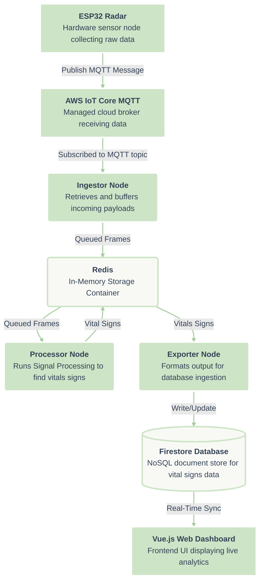

# CradleWave: Contactless Infant Vitals Monitoring 🍼📡

[](https://www.udel.edu)
[]()
[]()
[]()
[]()

**CradleWave** is an end-to-end IoT monitoring system that leverages 60 GHz FMCW radar to measure an infant's heart rate and respiration—completely avoiding the privacy concerns and physical discomfort of traditional cameras, microphones, or wearables.

This repository contains the complete systems engineering effort encompassing a custom 4-layer PCB, ESP32-S3 FreeRTOS firmware, a containerized Python digital signal processing (DSP) pipeline, and a real-time Vue 3 dashboard.

## 🚀 Tech Stack Highlights

- **Hardware & Firmware:** ESP32-S3, Infineon XENSIV 60GHz Radar (BGT60TR13C), Custom 4-Layer PCB, C/C++, ESP-IDF, FreeRTOS
- **DSP & Data Pipeline:** Python (NumPy, SciPy), Docker Compose microservices, Redis, AWS IoT Core (MQTT over TLS)
- **Frontend & Database:** Vue 3, ECharts, Google Firestore, Firebase Hosting

## 💡 The Problem & Our Solution

Each year, thousands of infants in the US are affected by SIDS or sleep-related suffocation. Existing monitors are often uncomfortable, inconvenient, or limited in vital-sign coverage.

CradleWave targets contactless, continuous monitoring from a safe distance. The final prototype integrates an Infineon BGT60TR13C radar shield with a custom ESP32-S3 PCB to stream raw multi-dimensional radar data over WiFi. The data is processed via an algorithmic pipeline in the cloud to extract physiological vitals, which are then surfaced on a responsive web UI.

### Key Engineering Achievements

- Developed a high-bandwidth IoT pipeline using MQTT/TLS to stream raw binary radar data asynchronously from an ESP32 to AWS IoT Core.
- Built a multi-container Docker compose DSP microservice, orchestrating Python with Redis to filter out environmental noise.
- Designed and verified an algorithmic pipeline (using FFT, moving target indicators, and bandpass filters) that calculates BPM/RPM to +-5/+-3 accuracy points from noisy FMCW data.
- Built an end-to-end Vue.js SPA dynamically synced via Firestore, handling real-time data visualisations of signals at sub-second refresh rates.

## System Architecture



## 🏗️ Project Architecture & Repositories

```
CradleWave/
├── CAD_Designs/                # Fusion360 3D Enclosure Designs
├── station_example_main.c      # ESP-IDF FreeRTOS Firmware Logic (Radar SPI + WiFi + MQTT)
├── local_testing/              # Local Docker Compose setup for iterating on MQTT and signal loops
├── mqtt_test/                  # Raw payload tests and Python MQTT test scripts
├── demo_board_python/          # (Legacy) Initial prototype using Infineon demo board + Raspberry Pi
│
└── webdev/
    ├── backend/                # Python / Docker Compose Pipeline
    │   ├── ingestor/           # AWS IoT MQTT Handler
    │   ├── processor/          # DSP Pipeline (SciPy, FFT, filtering)
    │   └── exporter/           # Formatting & Firestore synchronization
    │
    └── frontend/               # Vue 3 SPA Dashboard
        ├── src/components/     # EChart graphs and dynamic components
        └── package.json
```

## 💻 Developer Quick Start

### Hardware / Firmware Setup (ESP32-S3)

The custom firmware is built using the **ESP-IDF** (`station_example_main.c`).

1. Install **ESP-IDF** toolchain v5.x
2. Export your IDF path: `. $HOME/esp/esp-idf/export.sh`
3. Enter `idf.py build flash monitor`

### Backend Signal Pipeline Simulation

Test out the containerized DSP node logic without deploying to Oracle Cloud.

```bash
cd local_testing
docker-compose up --build
```

This spins up a local Redis container and triggers the processor node over local test CSV data.

### Web Dashboard

```bash
cd webdev/frontend
npm install
npm run serve
```

Navigate to `localhost:8080` check out the Vue 3 ECharts SPA.

## 📉 Digital Signal Processing Pipeline

The backend processor service runs the raw data arrays via NumPy/SciPy:

1. **Range-Doppler Mapping:** 2D FFT to convert the raw frame data to a velocity plot across the sensor range.
2. **Integration:** Strongest returns from the doppler map are summed to isolate primary target activity.
3. **Moving Target Indicator (MTI):** High-pass subtracts background static objects.
4. **Bandpass Filtering:** Narrows the resulting waveform down to expected physiological frequencies (e.g. 48-160 Hz bandwidth mapped back to realistic physiological RPM/BPM rates).
5. **Peak Estimation:** Analyzes moving windows of 20 seconds using arg-max estimations.

## ⚖️ Safety & Standards

- Developed beneath **FCC Part 15** emission guidelines (staying within the 57 - 71GHz unlicensed radar operations). System utilizes 8 dB transmitter with 3dB antenna gain remaining well under bounds.
- Deep tissue penetration avoids via sub-0.1W/m2 operation levels.
- Designed adhering to **IEC/UL62368C-1** keeping surface child-touch temperatures bounded through custom multi-layer GND-plane PCB pour routing layout techniques.

## Team

**University of Delaware - CPEG 498 Senior Design Project (2025-2026)**

- **Colin Aten**
- **Logan Blackburn**
- **Robert Koenig**

## Acknowledgments

- University of Delaware ECE Department

## License

This project is developed as part of the University of Delaware Electrical and Computer Engineering Senior Design program.

## References

1. Infineon BGT60TR13C Radar Sensor Documentation
2. FMCW Radar Signal Processing for Vital Signs Detection
3. Welch's Method for Power Spectral Density Estimation

---
