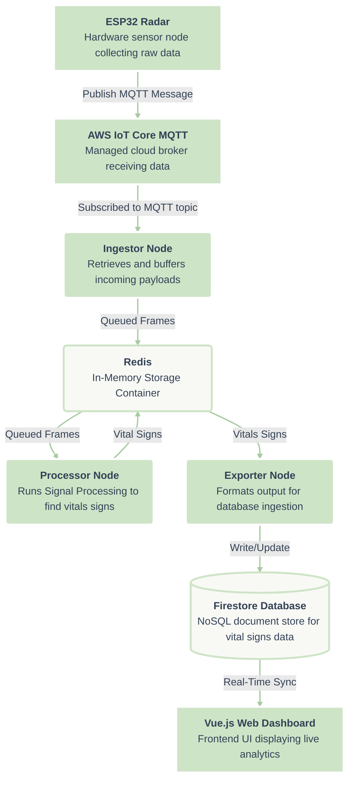

# CradleWave 🍼📡

**A Non-Contact Infant Vital Signs Monitoring System Using 60 GHz Radar**

[](https://www.udel.edu)
[](https://python.org)
[](https://vuejs.org)
[](LICENSE)

## Overview

CradleWave is a minimally intrusive baby monitoring system using **60 GHz FMCW radar sensor technology** to provide contactless vital sign monitoring for infants during sleep. Unlike traditional camera or microphone-based monitors, the system employs the **Infineon BGT60TR13C radar sensor** to detect heart rate and breathing patterns without physical contact or visual surveillance.

### Key Features

- 🫀 **Heart Rate Monitoring** - Real-time detection (48-150 BPM range)
- 🫁 **Breathing Rate Detection** - Continuous respiratory monitoring
- 📡 **Contactless Sensing** - No wearables or physical contact required
- 🔒 **Privacy Preserving** - No cameras or audio recording
- 📊 **Real-Time Dashboard** - Web-based visualization interface
- ☁️ **Cloud Integration** - Data stored in Google Firebase

## System Architecture



## Project Structure

```
CradleWave/
├── demo_board_python/          # Radar data acquisition & signal processing
│   ├── filtered.py             # Main radar processing with visualization
│   ├── filtered_no_plot.py     # Headless processing mode
│   ├── raspi_final.py          # Raspberry Pi deployment script
│   ├── requirements.txt        # Python dependencies
│   ├── helpers/                # Signal processing algorithms
│   │   ├── DopplerAlgo.py      # Doppler FFT processing
│   │   ├── DistanceAlgo.py     # Range processing
│   │   ├── sock.py             # Async WebSocket client
│   │   └── fft_spectrum.py     # FFT utilities
│   └── python_wheels/          # Infineon SDK wheels (multi-platform)
│
├── webdev/
│   ├── backend/                # FastAPI server
│   │   ├── app/main.py         # WebSocket & API endpoints
│   │   ├── Dockerfile          # Container configuration
│   │   └── requirements.txt    # Backend dependencies
│   │
│   └── frontend/               # Vue.js dashboard
│       ├── src/
│       │   ├── App.vue         # Main application
│       │   └── components/
│       │       ├── hrGraph.vue         # Heart rate chart
│       │       ├── breathingGraph.vue  # Breathing rate chart
│       │       ├── frameGraph.vue      # Raw signal visualization
│       │       └── devicetree.vue      # Device/session selector
│       └── package.json
│
├── CAD_Designs/                # 3D printed enclosure designs
└── cloudbuild.yaml             # Google Cloud Build configuration
```

## Hardware Requirements

- **Infineon DEMO-BGT60TR13C** - 60 GHz radar demo board
- **Raspberry Pi 4B** - Data acquisition and processing
- USB cable (Micro-USB to USB-A)
- Power supply for Raspberry Pi

## Software Requirements

### Raspberry Pi / Data Acquisition

- Python 3.12+
- Infineon Radar SDK 3.6.4
- NumPy, SciPy, Matplotlib
- websockets, msgpack

### Backend Server

- Python 3.12+
- FastAPI
- Google Cloud Firestore
- uvicorn

### Frontend Dashboard

- Node.js 18+
- Vue.js 3.x
- ECharts
- Firebase SDK

## Signal Processing Pipeline

The system implements a multi-stage signal processing pipeline:

1. **Moving Target Indicator (MTI)** - Removes static clutter using a 3rd-order Butterworth high-pass filter
2. **Sliding Average Filter** - Removes impulse noise
3. **Bandpass Filter** - Isolates vital signs frequency range (0.8-2.5 Hz for heart rate)
4. **FFT-based Estimation** - Uses Welch's method for robust heart rate extraction

```
Raw Radar Data → MTI Filter → Sliding Average → Bandpass Filter → FFT → Heart Rate (BPM)
```

## API Endpoints

### WebSocket Endpoints

| Endpoint           | Description                               |
| ------------------ | ----------------------------------------- |
| `/ws/data_handler` | Primary data ingestion from radar devices |
| `/ws/heart_rate`   | Legacy heart rate data endpoint           |
| `/ws/filtered`     | Filtered signal data endpoint             |

## Data Format

Data is transmitted via WebSocket using msgpack serialization:

```python
{
    "device": "device_id",
    "session_id": "session_YYYYMMDD_HHMMSS_xxxxx",
    "timestamp": 1702000000.0,
    "data": {
        "heart_rate_data": {
            "heart_rate": 72.5,
            "frame_count": 150,
            "time": 1702000000.0
        },
        "frame_data": {
            "frame_db": -45.2,
            "frame_count": 150
        },
        "breathing_rate_data": {
            "breathing_rate": 18.0,
            "frame_count": 150,
            "time": 1702000000.0
        }
    }
}
```

## Team

**University of Delaware - CPEG 498 Senior Design Project (2025-2026)**

- **Colin Aten**
- **Logan Blackburn**
- **Robert Koenig**

## Acknowledgments

- University of Delaware ECE Department

## License

This project is developed as part of the University of Delaware Electrical and Computer Engineering Senior Design program.

## References

1. Infineon BGT60TR13C Radar Sensor Documentation
2. FMCW Radar Signal Processing for Vital Signs Detection
3. Welch's Method for Power Spectral Density Estimation

---
